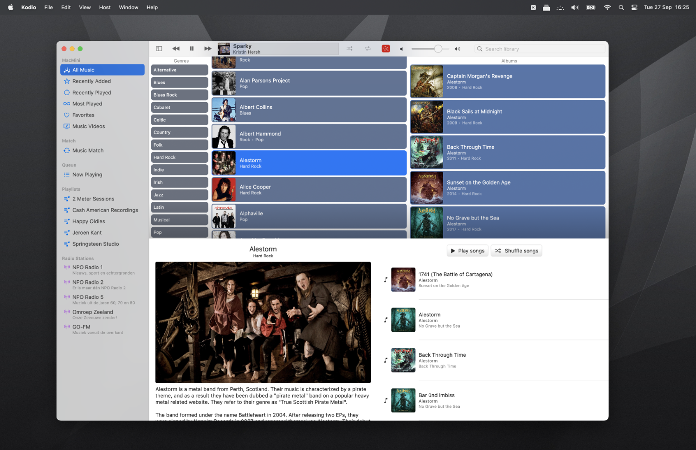

#  Kodio

## Play your own music

### Kodio is a Music Remote for [Kodi](https://kodi.tv), written in SwiftUI for macOS, iPad and iPhone.

For iOS, there are many 'remotes', also just for audio. However, on the Mac, there are none as far as I know. So I made my own.

I'm an old fashion guy, I like to play my own music and don't have a subscription to Apple Music or Spotify. In the good old days, I lived my musical life in iTunes, however, since it turned into Music it is not my friend anymore.

### Kodi is taking care of my music now

Besides to search for a good Mac Application to control my music I also like programming. Not being  a professional, I rewrote this application already a million times and it is far for perfect. Learning every day, rewrite every day. Part of the fun!

So, bugs are included for free!

#### General

- Radio stations are hard-coded at the moment.
- Adding a host is a bit back and forward; I don't know yet how to make this a bit more smooth.

#### macOS

- Animations are really buggy on macOS so I try to avoid them as much as possible. The spinning record on start-up behaves most of the time ok, however, sometimes it likes to travel from the top left corner.

#### iPad

- 'NavigationView' sucks; so I'm faking a 'three column' layout. Since I don't use navigation links the interface is a bit glitchy.

#### iPhone

- It's a dumbed-down version. For me phones are for making phone calls... Made it work on the iPhone because I can...

### Compile

Business as usual I think. There are no external dependencies in my application.

The only thing, I use SwiftLint to keep my code clean. It will just give a polite warning when you don't have it installed.

